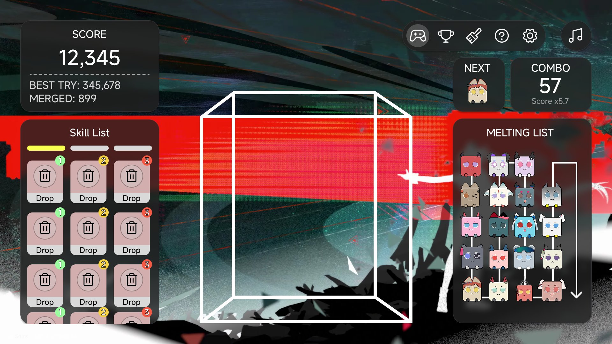

# EndchiMerge - 方團團大作戰

> *"Stack two identical dumplings and they reunite into a bigger one."*<br>
> A physics-driven merge game that runs in your browser. Drop square dumplings into a glass container, touch two of the same level together and they merge into the next one, all the way up to the biggest.

[](https://opensource.org/licenses/MIT)


Techstack:<br>


| <span style="color:#FF99CC">📢 Think it's fun? Share it with a friend!</span><br> | Going live soon (Vercel) |
|-|-|
| <span style="color:#05C189">📧 Suggestions or bug reports</span><br>| [Open an issue](https://github.com/Vocaloid2048/EndchiMerge/issues) |

## <span style="color:#C3D630"> 🚧 Please note
### This is an unofficial fan project
- Not affiliated with, endorsed by, or licensed by **Hypergryph** or **Gryphline**
- Inspired by the "山團團" mini-game from *Arknights: Endfield*
- All character names and related artwork remain the property of their respective owners
- This project is **completely free, with no purchases and no ads**, and will never be monetised in any form
- If a rights holder objects to anything here, we will take it down immediately

### Data collection
- We do not collect any sensitive personal data
- Progress and settings are stored only in your browser's local storage
- Once leaderboards are live, only the following will be uploaded: an anonymous device UUID, the display name you choose, and your score. **Nothing that identifies you**


## <span style="color:#569CD6">🏞️ Design</span>
||
|-|
|Main screen design (background art still in progress)|

## <span style="color:#569CD6">🎮 How to play</span>
1. Move the mouse / slide your finger to aim
2. Press (or tap) to drop the dumpling currently on show
3. Two dumplings of the **same level** touching each other → merge into the next level
4. Merges in quick succession build a **Combo**, raising the score multiplier
5. The container overflowing ends the run and banks your score

> **Current state**: **all five steps are playable**. Dumplings really fall, tumble and stack;
> same-level contact merges them, with a pop animation and a Combo multiplier of
> `min(e^(0.075n)/10, 9) + 1` that reaches the ×10.0 ceiling at 60 chained merges.
> Once the stack crosses the red dashed line 30 units above the container rim you get
> **3 seconds** to fix it; time out and the run ends with a score summary and a one-tap restart.
> Every level you merge into existence unlocks that character in the MELTING LIST, and **unlocks
> and the high score persist locally and survive a new run**. Arrow keys aim and Space/Enter drops.
> **SP and skills (M5) are done**: SP accrues from drops and merges, and four skills fire from
> the skill bar in the left column.

### Combo multiplier

| Chain | 1 | 10 | 23 | 30 | 42 | 60 |
|:--|:--|:--|:--|:--|:--|:--|
| Multiplier | ×1.1 | ×1.2 | ×1.6 | ×1.9 | ×3.3 | **×10.0** |

> The curve climbs **deliberately slowly**: it only hits the ceiling at 60. Several merges inside
> the same physics step count once; a cascade spread across steps accumulates normally. The curve
> constants live in `src/game/combo.ts → COMBO_CURVE`.

### Overflow rule

A red dashed line sits 30 units above the container's rim, with a pale red warning band between
the line and the rim. **As soon as anything in the stack crosses the line** a 3-second countdown
starts; push the stack back down and you are fine, leave it and the run ends.

> Only dumplings that have **joined the pile** count as crossing, and "joined the pile" means
> **touching another dumpling**. A dumpling still falling through the air does not count (not even
> if it clips the line), and neither does a lone dumpling resting on the floor that has only ever
> touched a wall or the floor — it occupies space but is not a stack. The drop point sits
> deliberately 10 units **above** the red line so the player can see the dumpling appear above it;
> counting in-flight dumplings would let rapid dropping fill the timer on its own
> (see [`docs/gameplay.md`](docs/gameplay.md) §4.3, in Chinese).

## <span style="color:#569CD6">🧩 Merge chain (10 levels)</span>
Start with the smallest, 萊萬汀, and work your way up to 梨諾:

| Level | Character | Level | Character |
|:--:|:--|:--:|:--|
| 1 | 萊萬汀 | 6 | 莊方宜 |
| 2 | 潔爾佩塔 | 7 | 弭弗 |
| 3 | 伊馮 | 8 | 卡繆 |
| 4 | 湯湯 | 9 | 訣 |
| 5 | 洛茜 | 10 | 梨諾 |

> The chain length, character names and every per-level physics value live in JSON. Adding a character or retuning the numbers never requires a rebuild.

## <span style="color:#569CD6">⚡ SP and skills</span>
Every successful drop banks **0.05 SP**, and every merge banks another **0.05 SP**. The gauge doubles as the unlock gate — and it reads the **current** value, so a skill lights up while the gauge is high enough and locks again the moment you spend.

| Skill | Effect | Cost |
|:--|:--|:--:|
| 當棄即棄！ (Discard) | Pick one dumpling in the container and remove it; whatever was resting on it falls in | 1 |
| 協議：浮動 (Protocol: Float) | Lift **all** dumplings upward for a short while, opening up merge opportunities; they stop at an invisible plane just below the warning zone | 2 |
| 搖晃！ (Shake!) | Rattle the whole container side to side like an earthquake to break up a jammed stack | 3 |
| 命運互換 (Fate Swap) | Pick **two** dumplings, swap their positions and stir the physics around them | free\* |

> \* Fate Swap is not bought with SP: it unlocks once you have **spent 6 SP in total this run**,
> and using it resets that running total, locking it again.
>
> The skill table is JSON-defined too; the number of skills is not hard-coded, and the SP cap
> defaults to 3 (settable to any integer from 1 to 10). A skill is charged only when its effect
> actually runs — selecting costs nothing and cancelling refunds nothing. **Dropping is blocked
> while a skill acts**, including while a target is being picked.

## <span style="color:#569CD6">✨ Features</span>
- ✅ **Real physics**: driven by Matter.js — gravity, collision and stacking all follow genuine mechanics, with tunable parameters
- ✅ **Faithful colliders**: colliders are not circles but **polygons traced from the sprite's alpha channel** (contour tracing + RDP simplification + `poly-decomp` convex decomposition), so horns and wings count. Missing art or a degenerate contour falls back to a circle automatically
- ✅ **Fixed timestep**: physics advances in fixed 1/60s steps so the feel never changes with display refresh rate; the per-frame step count is capped so a backgrounded tab cannot blow the box apart
- ✅ **Config-driven**: levels, skills, container frame and branding all live in `public/config/`, editable without a rebuild
- ✅ **Hand-drawn art**: dumplings are authored as vector art and exported as lossless 512×512 WebP; the white outline hugs the character silhouette rather than the image bounds
- ✅ **Art aligned to physics**: sprites scale from the collision radius, and the collider is traced from the very same alpha channel — the two coincide exactly
- ✅ **Merging and combos**: same-level contact merges, handled in two phases (the collision callback only collects; the merge runs after the physics step). The combo multiplier is a non-linear curve topping out at ×10.0
- ✅ **A visible overflow rule**: red dashed line, pale red warning band and a 3-second countdown — and it only measures dumplings that have **joined the pile** (touched another dumpling)
- ✅ **Unlocks and codex**: merging a level into existence unlocks that character (the MELTING LIST *is* the codex); unlocks and the high score persist across runs
- ✅ **SP and skills**: SP accrues from drops and merges and gates skills on its **current** value
  (spending locks them again instantly); each of the four skills is its own class acting through
  a narrow board interface, with costs and parameters all coming from JSON
- ✅ **Fallback first**: missing art or config degrades gracefully and never leaves a blank screen
- ✅ **Tested**: deterministic logic (config loading, layout, geometry, sampling, timestep) has unit coverage
- ✅ **Free and open source**: MIT licensed. Play it, fork it, change it

## 💻 Running locally
<details>

```bash
# 1. Clone the repo
git clone https://github.com/Vocaloid2048/EndchiMerge.git

# 2. Enter the directory
cd EndchiMerge

# 3. Install dependencies
npm install

# 4. Start the dev server
npm run dev
```

Other commands:

```bash
npm run build      # typecheck + bundle
npm run preview    # preview the production build
npm run typecheck  # typecheck only
npm test           # run unit tests once (Vitest)
npm run test:watch # unit tests in watch mode
```

Requires Node.js 20 or newer.
</details>

## 📂 Project structure
<details>

```
EndchiMerge
├─docs                          # Documentation
│  ├─physics.md                 # Derivation of the physics numbers and why they are provisional
│  ├─gameplay.md                # Merge / combo / overflow / unlock rules and tuning map
│  ├─rendering.md               # Draw order and the visual tuning map
│  ├─asset-signatures.md        # How character asset metadata signing works
│  ├─CHANGELOG.md               # What each milestone delivered
│  └─design-main-screen.jpg     # Main screen design
├─public                        # Served verbatim, never bundled
│  ├─config                     # Game configuration (externalised, no rebuild needed)
│  │  ├─levels.json             # The 10-level merge chain and per-level physics
│  │  ├─skills.json             # SP settings and the skill table
│  │  ├─container.json          # Container U-shape frame & drop padding parameters
│  │  └─branding.json           # Game name, notices, repo link
│  └─assets                     # Art and audio
│     ├─character               # Dumpling assets (<name>_img.webp)
│     ├─icons                   # Toolbar icons
│     ├─ui                      # Panel decoration (incl. the geometric backdrop)
│     └─audio                   # Sound effects
├─src
│  ├─core                       # Foundation with no business logic
│  │  ├─types.ts                # Types for config and game state
│  │  ├─constants.ts            # Global constants (incl. the sprite normalisation trio)
│  │  ├─design.ts               # Design constants (Figma Group 445 rects, grid, track)
│  │  ├─rng.ts                  # Seedable random source (for deterministic tests)
│  │  ├─configLoader.ts         # Runtime config loading with per-field fallback
│  │  ├─physics.ts              # Matter.js engine wrapper
│  │  └─input.ts                # Drop input (pointer and keyboard)
│  ├─game                       # Per-run logic
│  │  ├─session.ts              # Drops, aiming, merging, combos, overflow, body recycling
│  │  ├─merge.ts                # Merge-table lookup (pure)
│  │  ├─combo.ts                # Combo window and multiplier curve (pure)
│  │  ├─overflow.ts             # Overflow grace countdown (pure, no geometry)
│  │  ├─progress.ts             # Unlocks and high score (localStorage, injectable)
│  │  ├─spawnQueue.ts           # Spawn queue (peekAt(0) in hand, peekAt(1) NEXT) + unlock filter
│  │  ├─containerBox.ts         # Physics boundaries (walls and floor)
│  │  └─loop.ts                 # Fixed-timestep frame loop
│  ├─render                     # Drawing
│  │  ├─viewport.ts             # Virtual coordinate system and scaling
│  │  ├─container.ts            # Container wireframe geometry
│  │  ├─stage.ts                # Canvas drawing for the container and dumplings
│  │  ├─silhouette.ts           # Alpha contour tracing + RDP (pure, node-testable)
│  │  ├─silhouetteLoader.ts     # Contour cache (OffscreenCanvas alpha → polygons)
│  │  ├─spriteLoader.ts         # Asset loading and fallback
│  │  └─placeholder.ts          # Programmatic placeholder dumpling
│  ├─ui                         # DOM surfaces
│  │  ├─layout.ts               # Seven regions, absolutely placed on the design canvas
│  │  ├─scale.ts                # Uniform scaling of the design canvas
│  │  ├─designTokens.ts         # Design numbers → CSS custom properties
│  │  ├─meltingList.ts          # Roster rendering and the serpentine track (the codex)
│  │  ├─serpentine.ts           # Serpentine layout + track geometry
│  │  ├─spMeter.ts              # SP meter (one segment per point)
│  │  ├─hud.ts                  # NEXT / SCORE / COMBO card updates
│  │  ├─gameOver.ts             # End-of-run overlay
│  │  ├─icons.ts                # Inline SVG icons
│  │  ├─notice.ts               # Unofficial notice
│  │  └─dom.ts                  # Small DOM helpers
│  ├─styles
│  │  ├─main.css                # Reset, layout host and import order
│  │  ├─tokens.css              # Colour, spacing and radius variables
│  │  ├─panels.css              # Shared panel styles (liquid glass)
│  │  ├─layout.css              # Seven-region layout styles
│  │  ├─melting-list.css        # Roster cells and the track
│  │  ├─game-over.css           # End-of-run overlay
│  │  └─sprite.css              # Silhouette outline
│  ├─main.ts                    # Application entry point (assembly only)
│  └─vite-env.d.ts
├─tests                         # Vitest unit tests (deterministic logic)
├─scripts
│  ├─sign-assets.mjs            # Signs character assets (SVG / PNG / WebP)
│  └─install-git-hooks.mjs      # Sets core.hooksPath (runs after npm install)
├─.githooks
│  └─pre-commit                 # Signs staged character assets before committing
├─.github
│  └─workflows                  # CI (asset signature backstop)
├─index.html
├─package.json
├─tsconfig.json / tsconfig.app.json / tsconfig.node.json / tsconfig.test.json
├─vite.config.ts
└─vitest.config.ts
```

> The dependency direction is fixed at `core/` ← `game/` ← `render/` ← `ui/` ← `main.ts`:
> lower layers never know about higher ones. `render/` has no idea Matter.js exists —
> `render/stage.ts` consumes plain data.
</details>

## <span style="color:#569CD6">🚦 Progress</span>
| Phase | Scope | Status |
|:--|:--|:--:|
| M0 | Scaffold, config system, WebP asset loading | ✅ Done (**outline baking and radius calibration still missing**) |
| M1 | Layout skeleton (7 regions), coordinate system, visuals, responsive | ✅ Done |
| M2 | Serpentine roster (auto layout) + silhouette outline | ✅ Done |
| M3 | Container rendering (flat U-shape frame), drop input, NEXT queue | ✅ Done |
| M4 | Merge core, cooldown, combo, pop animation, overflow and game over | ✅ Done |
| M5 | SP and skills (incl. click-to-select and the 「」marker) | ✅ Done |
| M6 | Unlock system, `???`, codex (= the MELTING LIST) | ✅ Done |
| M7–M9 | Save data and backend sync, leaderboards, analytics and anti-cheat | ⏳ Pending |
| M10 | Deployment, audio, accessibility | ⏳ Pending |

> What M0 still owes is **outline baking** and the **collision-radius calibration prototype**:
> the radii and physics numbers in `levels.json` are all provisional and will be recomputed
> once that prototype lands. A knock-on effect: with Lv1 at r=20 against a 730×784 play area,
> it currently takes roughly 130 near-continuous drops (one per 100 ms) to actually stack up to
> the overflow line. M6 does not depend on M5, so the order they landed in does not affect the
> codex or unlocks. Full details in [`docs/CHANGELOG.md`](docs/CHANGELOG.md); the rules themselves
> in [`docs/gameplay.md`](docs/gameplay.md).

> **v1.8 — outline colliders and pile detection**: dumpling colliders changed from **circles** to
> **polygons traced from the sprite's alpha channel** (Moore-neighbour tracing + RDP
> simplification + `poly-decomp` convex decomposition), typically 30–46 vertices, so horns and
> wings count; missing art or a degenerate contour falls back to a circle. Because an outline
> collider is a compound body, the collision pairs carry child parts, so `GameSession` gained
> `resolveEntry()`, which walks up via `body.parent`. "Joined the pile" for overflow purposes now
> means **touching another dumpling** (wall and floor contact do not count), so a falling dumpling
> clipping the red line is no longer a false positive.

> **v1.7 — merging and the codex**: the container became a **flat U-shape** (rounded bottom,
> 20% white fill) and both the drop point and the overflow line are now derived from the
> container's rim (40 / 30) instead of hard-coded coordinates. Merge detection is split into
> "the collision callback only collects → the merge runs after the physics step". The combo
> multiplier is now a non-linear curve topping out at ×10.0 at 60 chained merges. Per the
> user's decision the MELTING LIST **is** the codex, unlock checks key off the level id, and the
> spawn pool filters out anything not yet unlocked.

> **v1.6 — UI brought in line with the mock**: the layout is now a **fixed 1920×1080 design
> canvas scaled by a single `transform: scale()`**, with every panel placed at the coordinates
> taken from the Figma file's `Group 445`. Browser zoom at 110% / 90% no longer changes the
> size of anything relative to anything else (so zooming out can no longer fit extra roster
> cells). The MELTING LIST follows the mock's **4×5 column-major serpentine**, and its
> connector is one continuous path with 32-radius fillets and an arrowhead. The NEXT card now
> shows the dumpling that takes the field **after** the one in hand (D22 revised).

## 🙏 Credits
- Gameplay inspired by the "山團團" mini-game in *Arknights: Endfield*, all rights reserved by **Hypergryph / Gryphline**
- Character designs remain the property of **Hypergryph / Gryphline**; this project exists as a technical demonstration and fan work only
- AI usage: most of the code and documentation in this project is AI-assisted; the character artwork is hand-drawn:
  - Code: Claude, CodeBuddy
  - Text: Claude

### Contributors
<a href="https://github.com/Vocaloid2048/EndchiMerge/graphs/contributors">
  
</a>

---

[繁體中文版](README.md)
